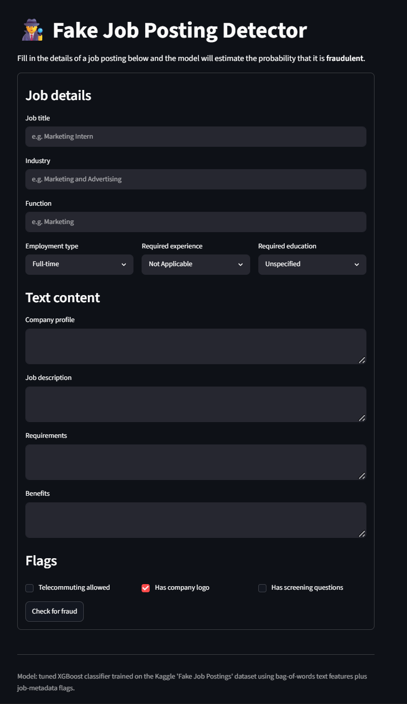
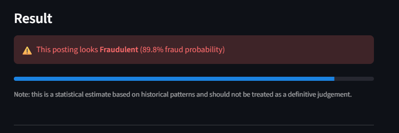

# 🛡️ Fake Job Posting Detection using Machine Learning

A Machine Learning-powered web application that detects whether a job posting is **Legitimate** or **Fraudulent** using Natural Language Processing (NLP), Count Vectorization, and XGBoost.

Built with **Python**, **Streamlit**, **Scikit-learn**, **spaCy**, and **XGBoost**.

---

## 🚀 Live Demo

🔗 **Streamlit App:** https://fake-jobpostings-fraud-detection-kc-shish.streamlit.app/

---

## 📌 Features

- 🔍 Detects fraudulent job postings in real time
- 📝 NLP-based text preprocessing
- 📊 Uses Count Vectorizer for feature extraction
- 🤖 XGBoost classifier for prediction
- 📈 Displays fraud probability
- 🌙 Modern dark-themed Streamlit interface
- ⚡ Instant prediction

---

## 🖥️ Application Preview

### 🏠 Home Page

<p align="center">
  
</p>

### 🔍 Prediction Example

<p align="center">
  
</p>

---

## 🧠 Machine Learning Pipeline

### 📊 Data Preprocessing

- Removed duplicate job postings
- Handled missing values
- Cleaned textual data
- Removed HTML tags
- Removed URLs and email addresses
- Removed numbers and special characters
- Converted text to lowercase
- Tokenization and Lemmatization using **spaCy**
- Removed stop words
- Combined multiple text fields into a single corpus

### ⚙️ Feature Engineering

- Count Vectorization (Bag of Words)
- One-Hot Encoding for categorical features
- Binary encoding for metadata flags
- Sparse feature matrix generation

### 🤖 Machine Learning Model

- **Algorithm:** XGBoost Classifier
- **Text Representation:** CountVectorizer
- **Model Serialization:** Joblib

### 🔄 Prediction Workflow

```text
User Input
     │
     ▼
Text Cleaning & Preprocessing
     │
     ▼
Count Vectorizer
     │
     ▼
One-Hot Encoding
     │
     ▼
Feature Alignment
     │
     ▼
XGBoost Classifier
     │
     ▼
Fraud Probability
     │
     ▼
Legitimate / Fraudulent Prediction
```

### 🛠️ Tech Stack

| Category | Technologies |
|----------|--------------|
| Programming Language | Python |
| Machine Learning | Scikit-learn, XGBoost |
| NLP | spaCy, CountVectorizer |
| Data Processing | Pandas, NumPy, SciPy |
| Web Framework | Streamlit |
| Model Persistence | Joblib |
| Version Control | Git, GitHub |

### 📈 Model Features

- ✅ Real-time fraud detection
- ✅ NLP-based text preprocessing
- ✅ Fraud probability prediction
- ✅ Modern Streamlit interface
- ✅ Fast inference
- ✅ Recruiter-friendly UI
- ✅ GitHub & Streamlit Cloud deployment

### Data Preprocessing

- Removed duplicate records
- Missing value handling
- Text cleaning
- HTML removal
- URL removal
- Email removal
- Number removal
- Lemmatization using spaCy
- Stopword removal

### Feature Engineering

- Count Vectorization
- One-Hot Encoding
- Sparse Matrix Combination

### Models Tested

- Naive Bayes
- Logistic Regression
- XGBoost

### Final Model

✅ XGBoost (Hyperparameter Tuned)

---

## 📂 Project Structure

```text
Fake-Job-Posting-Detection/
│
├── app.py
├── predict.py
├── requirements.txt
├── README.md
│
├── artifacts/
│   ├── fraud_detection_model.pkl
│   ├── count_vectorizer.pkl
│   └── feature_columns.pkl
│
├── notebooks/
│   └── source_code.ipynb
│
├── assets/
│   ├── home.png
│   └── prediction.png
│
└── dataset/
    └── fake_job_postings.csv
```

---

## 📊 Dataset

**Dataset:** Fake Job Postings Dataset

Features include:

- Job Title
- Company Profile
- Description
- Requirements
- Benefits
- Industry
- Function
- Employment Type
- Required Experience
- Required Education
- Company Logo
- Screening Questions
- Telecommuting

Target:

- Fraudulent
- Legitimate

---

## ⚙️ Installation

Clone the repository

```bash
git clone https://github.com/YOUR_USERNAME/Fake-Job-Posting-Detection.git
```

Move into the project

```bash
cd Fake-Job-Posting-Detection
```

Install dependencies

```bash
pip install -r requirements.txt
```

Download spaCy model

```bash
python -m spacy download en_core_web_sm
```

Run the application

```bash
streamlit run app.py
```

---

## 💻 Technologies Used

- Python
- Streamlit
- Scikit-learn
- XGBoost
- spaCy
- Pandas
- NumPy
- SciPy
- Joblib

---

## 📈 Model Workflow

```text
User Input
      │
      ▼
Text Preprocessing
      │
      ▼
Count Vectorizer
      │
      ▼
Feature Engineering
      │
      ▼
XGBoost Model
      │
      ▼
Prediction
      │
      ▼
Legitimate / Fraudulent
```

---

## 🎯 Sample Prediction

### Legitimate Job

```
Prediction:
✅ Legitimate Job

Confidence:
99.99%
```

### Fraudulent Job

```
Prediction:
🚨 Fraudulent Job

Confidence:
76.07%
```

---

## 📌 Future Improvements

- Explainable AI (SHAP)
- Resume matching
- Batch CSV prediction
- REST API with FastAPI
- Docker deployment
- User authentication
- Confidence visualization

---

## 👨‍💻 Author

**Aashish**

LinkedIn: *(Add your LinkedIn URL)*

GitHub: *(Add your GitHub URL)*

---

## ⭐ Support

If you found this project useful, consider giving it a ⭐ on GitHub!
